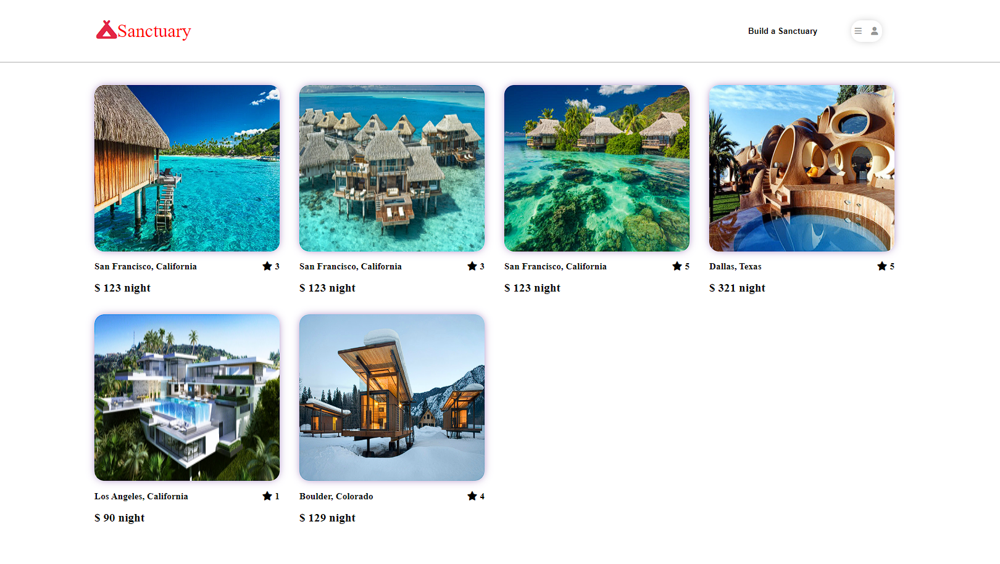
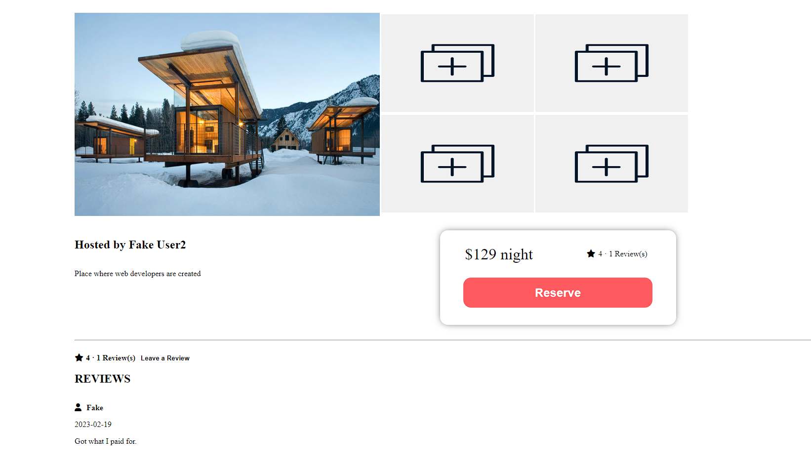

# `About Sanctuary`


## This project is being made to emulate the AirBnb web application. Rebrand to "SANCTUARY" since users will be requesting safe haven from the outdoors through a monetary exchange. At the moment, CRUD for two features have mostly been completed thus far. Locations and Reviews features are set to test their full CRUD capabilities. Home page gives you quck access to brief preview of the spot and its pricing. Clicking anywhere on the spot image or body description takes you to a further detail route with information on that spot. Here you can see reviews, make reviews, as well as delete said reviews and said spot if logged in as the owner. Both home page and spot details page have access to a nav bar at top where you can always view user profile options(login etc), create a new listing for a sanctuary, and as well as quicly navigate back to home page. Users can now create bookings for each spot land manage those bookings using user prfile dropdown.

# Technologies Used:
- React
- Redux 
- Sequel
- Sequelize 
- Javascript
- NodeJS
- CSS
- Database: PostgresSQL
- Hosting: Render

## Getting started
1. Clone this repository (only this branch)

2. Install dependencies

      ```bash
      pipenv install -r requirements.txt
      ```

3. Create a **.env** file based on the example with proper settings for your
   development environment

4. Make sure the SQLite3 database connection URL is in the **.env** file

5. This starter organizes all tables inside the `flask_schema` schema, defined
   by the `SCHEMA` environment variable.  Replace the value for
   `SCHEMA` with a unique name, **making sure you use the snake_case
   convention**.
   
6. Use Sequelize-cli commands to migrate and seed database.
  ```bash
   npx sequelize-cli init

   ```

   ```bash
   npx dotenv sequelize db:migrate

   ```

   ```bash
   npx dotenv sequelize-cli db:seed:all

   ```

   ```bash
   npm start
   ```
7. To run the React App in development, checkout the [README](./react-app/README.md) inside the `react-app` directory.


# Features Directions:

### Checkout the illustrations below depicting how users can interact with basic CRUD functionality for specific features

## Demo User/Log in
### Some functionality of site is locked behind a user needing to be logged in. Create a new one or use our demo user when trying to log in.


## Sign-up:


## Splash Page:
### Shows recent activity from users leaving reviews


## List of all current listings (Maps integration coming soon)


## Create your buisnesses listing on our site


## View details of any location, start a review, and more to come.


## Create your own review about a location.


## Bonus Feature

## User Profile Page can be used to manage reviews and update profile photo


# Features Coming Soon
## Google maps api integration
## Filtered Search on navbar and locations listing page.


## Current Spot Details Page on creation and no updates

