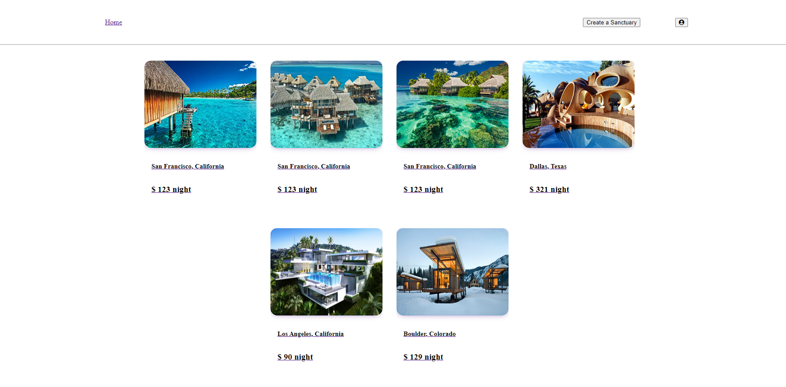

# `Sanctuary`

## This project is being made to emulate the AirBnb web application. Rebrand to "SANCTUARY" since users will be requesting safe haven from the outdoors typically in a monetary exchange. More features and specific styling will be implemented soon. At the moment CRUD for two features have mostly been completed thus far. Locations you can find to rent out are set to test their loading, creation, editing, and delete abilities. The second feature completed involving reviews for said locations are set to test for Create, read, and delete. Both features have their user authorization and input requirements enabled. Home page gives you quck access to brief preview of the spot and its pricing. Clicking anywhere on the spot image or body description takes you to a further detail route with information on that spot. Here you can see reviews, make reviews, as well as delete said reviews and said spot if logged in as the owner. These functionalities will be moved to a more apporpriate location soon. Both home page and spot details page have access to a nav bar at top where you can always view user profile options(login etc), create a new listing for a sanctuary, and as well as quicly navigate back to home page.

The main technologies utiilized for this project are React and Redux for front end creation, sequel and sequelize for back end api integration, and Javascript as the primary language.

## Current Home Page

